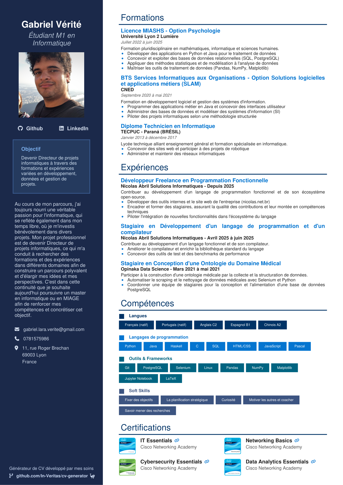

# CV Generator

Un script Python qui produit un CV professionnel en PDF deux colonnes a partir de fichiers de configuration JSON. Concu pour plaire aux recruteurs, compatible ATS (Applicant Tracking System) et optimise pour les dossiers d'admission en master. Chaque aspect est configurable via des parametres. Les debutants peuvent simplement modifier le fichier `cv_data.json`, tandis que les utilisateurs avances peuvent intervenir sur `cv_style.json` ou directement sur `generate_cv.py` pour des ajustements plus fins. Un tutoriel est disponible ci-dessous. Vous pouvez egalement changer la langue du CV via `cv_lang.json`, mais une relecture manuelle du texte traduit est recommandee.

## Apercu



## A quoi ca sert

- **Candidatures en master** (MonMaster, dossiers universitaires) -- optimise pour les jurys d'admission francais
- **Candidatures a l'emploi** -- mise en page compatible ATS avec un taux eleve de detection de mots-cles
- **Profils freelance / professionnels** -- design moderne et epure avec des liens cliquables
- **CV multilingues** -- basculez entre francais, anglais, espagnol et portugais en un seul changement de configuration

## Comment ca marche

Le generateur lit trois fichiers JSON et produit un PDF A4 d'une page :

1. **`cv_data.json`** -- Votre contenu (qui vous etes, ce que vous avez fait)
2. **`cv_style.json`** -- L'apparence (couleurs, polices, tailles, espacements)
3. **`cv_lang.json`** -- Les libelles de section dans la langue choisie

Le script utilise `fpdf2` pour generer une mise en page a deux colonnes : une barre laterale bleu marine fonce (30%) avec les informations personnelles, la photo, l'objectif et les coordonnees, et une zone principale blanche (70%) avec les formations, experiences, competences et certifications. Tout le texte de la zone principale est quasi-noir sur blanc pour une lisibilite ATS maximale.

Les descriptions supportent les listes a puces : les lignes commencant par `-` sont automatiquement rendues avec des puces colorees et une indentation.

## Utilisation

```bash
pip install -r requirements.txt
python generate_cv.py
```

### Options

```bash
python generate_cv.py --data cv_data.json --style cv_style.json --lang cv_lang.json -o output.pdf
```

| Option    | Defaut          | Description                          |
| --------- | --------------- | ------------------------------------ |
| `--data`  | `cv_data.json`  | Chemin vers le contenu du CV         |
| `--style` | `cv_style.json` | Chemin vers la configuration visuelle |
| `--lang`  | `cv_lang.json`  | Chemin vers les libelles de langue    |
| `-o`      | `cv_output.pdf` | Chemin du PDF de sortie              |

### Changer la langue

Editez `cv_lang.json` et modifiez le champ `"lang"` :

```json
{
  "lang": "fr"
}
```

Disponible : `"fr"` (francais), `"en"` (anglais), `"es"` (espagnol), `"pt"` (portugais).

Cela change les titres de section (Formations, Experiences, Competences, Certifications) et le titre de l'encadre Objectif. Le contenu lui-meme (descriptions, titres) doit etre traduit manuellement dans `cv_data.json`.

## Structure des fichiers

| Fichier            | Role                                                                         |
| ------------------ | ---------------------------------------------------------------------------- |
| `generate_cv.py`   | Script principal du generateur (~800 lignes)                                 |
| `cv_data.json`     | Contenu du CV (infos personnelles, formations, experiences, competences, certifications) |
| `cv_style.json`    | Parametres visuels (polices, tailles, couleurs, espacements, badges, pied de page) |
| `cv_lang.json`     | Libelles de langue pour les titres de section                                |
| `fonts/`           | Fichiers OTF Font Awesome 7 pour les icones                                 |
| `badges/`          | Images des badges de certification (Credly)                                  |
| `requirements.txt` | Dependances Python (`fpdf2`)                                                 |

## Fonctionnalites

### Mise en page deux colonnes

La disposition barre laterale (30%) + contenu principal (70%) est l'un des formats de CV modernes les plus populaires :

- La barre laterale regroupe les informations personnelles/contact separement du contenu professionnel
- Les recruteurs peuvent localiser rapidement les coordonnees
- La zone principale offre amplement d'espace pour les descriptions d'experience
- Les systemes ATS peuvent analyser la zone de contenu principal de maniere fiable

### Icones Font Awesome

Le generateur detecte automatiquement les fichiers OTF/TTF Font Awesome dans le repertoire `fonts/` :

- **Liens sociaux** (GitHub, LinkedIn) -- police `fa-brands`
- **Marqueurs de contact** (email, telephone, adresse) -- police `fa-solid`
- **Liens de certification** -- icone de lien cliquable a cote de chaque nom
- **Decorations du pied de page** -- icones gauche/droite configurables

Retour gracieux en mode texte seul si les polices ne sont pas presentes.

### Badges de certification

Chaque certification peut afficher son image de badge officiel (ex. Credly) a cote du nom et de l'organisme emetteur. Les images de badge sont cliquables et renvoient vers la page de la certification.

### Formatage des listes a puces

Les descriptions supportent un format hybride -- une phrase de contexte suivie de puces :

```json
"description": "Phrase de contexte sur le poste.\n- Premiere realisation ou responsabilite\n- Deuxieme realisation avec resultats quantifies\n- Troisieme point"
```

Les lignes commencant par `-` sont rendues avec des puces colorees et une indentation appropriee.

### Support photo

Supporte les formats JPG, JPEG, PNG, BMP et GIF. Si le nom de fichier exact n'est pas trouve, le generateur essaie automatiquement les extensions courantes.

### Badges de competences colores

La section competences utilise des badges pilules colores groupes par categorie, chacun avec une couleur distincte de la famille des bleus pour la coherence visuelle.

## Personnalisation

### Modifier le contenu

Editez `cv_data.json` :

- `personal` : nom, titre, photo, objectif, a propos, coordonnees, liens sociaux
- `formations` : entrees de formation avec descriptions a puces
- `experiences` : entrees d'experience avec descriptions a puces
- `skills_section` : badges de competences par categorie (langues, programmation, outils, soft skills)
- `certifications` : entrees de certification avec URLs et images de badge optionnels

### Modifier le style

Editez `cv_style.json` pour ajuster tout parametre visuel :

- **Barre laterale** : ratio de largeur, couleur de fond, padding, taille de photo
- **Polices** : familles titre/corps, polices TTF/OTF personnalisees
- **Tailles de police** : chaque element de texte a sa propre taille configurable
- **Couleurs** : chaque element a sa propre couleur RGB
- **Espacements** : ecarts entre chaque section, ratio de hauteur de ligne
- **Badges** : padding, rayon, ecart, couleurs par style (rempli/contour/accent)
- **Section competences** : tailles de badges, couleurs par categorie
- **Certifications** : taille d'image, grille, colonnes
- **Encadre objectif** : fond, bordure, couleur du titre, couleur du texte, padding, rayon
- **Pied de page** : texte, taille de police, couleur, icones, URL de lien et image optionnels

### Utiliser des polices personnalisees

Ajoutez des fichiers TTF/OTF et referencez-les dans le style :

```json
"fonts": {
  "heading": "MaPolice",
  "body": "MaPolice",
  "custom": {
    "MaPolice": {
      "": "fonts/MaPolice-Regular.ttf",
      "B": "fonts/MaPolice-Bold.ttf",
      "I": "fonts/MaPolice-Italic.ttf"
    }
  }
}
```

## Recherche sur le design

### Palette de couleurs

La palette a ete choisie sur la base de recherches provenant de sources du secteur du recrutement sur ce qui fonctionne le mieux aupres des recruteurs humains et des outils de screening ATS/IA.

**Pourquoi le bleu marine ?**

- Le bleu est la couleur de CV n1 recommandee par toutes les sources -- il evoque la confiance, la fiabilite et la competence
- Particulierement adapte au secteur tech/IT puisque la plupart des grandes entreprises technologiques utilisent le bleu dans leur branding
- La couleur bleu marine fonce pour les titres (`#003366`) a atteint un **taux de detection de mots-cles ATS de 98%** lors des tests

| Element            | Hex       | Justification                                       |
| ------------------ | --------- | --------------------------------------------------- |
| Fond barre laterale | `#1B2A4A` | Ratio de contraste avec texte blanc : ~12.5:1 (WCAG AAA) |
| Titres de section  | `#003366` | Taux de detection ATS de 98%                        |
| Titres d'elements  | `#0476D0` | Recommande pour les CV tech/IT                      |
| Texte principal    | `#212121` | Contraste avec blanc : ~16:1 (WCAG AAA)             |
| Texte secondaire   | `#555555` | Contraste avec blanc : ~7.5:1 (WCAG AA)             |

### Regles de compatibilite ATS

1. Le texte principal est quasi-noir sur blanc -- la "Regle 90-10"
2. Tous les mots-cles critiques sont dans la zone blanche principale, pas dans la barre laterale
3. Ratios de contraste eleves (minimum 4.5:1 selon WCAG AA) sur chaque combinaison texte-fond
4. Palette coherente a 2 couleurs (marine + accent bleu) plus neutres
5. Polices standard (Helvetica) -- universellement analysables par les ATS

### Formatage des descriptions

Les descriptions suivent les bonnes pratiques de CV academique pour les candidatures en master :

- Format hybride : une phrase de contexte + listes a puces
- Verbes d'action a l'infinitif (convention francaise)
- Realisations quantifiees autant que possible
- Mots-cles refletant les descriptions des programmes cibles

## Pied de page

Le pied de page en bas de la barre laterale affiche une ligne de texte avec des icones decoratives et un lien cliquable vers le depot.

**Texte dynamique :** Lorsque le nom du CV est "Gabriel Verite" (l'auteur), le pied de page affiche *"Generateur de CV developpe par mes soins"*. Pour tout autre nom, il change automatiquement en *"CV generated with In:Veritas CV Generator"*. Les deux textes sont configurables via `text` et `text_other` dans `cv_style.json`.

**Dates de certification :** Chaque entree de certification supporte un champ optionnel `"date"` affiche en petit texte italique sous l'organisme emetteur.

### Icone baleine

La petite icone de baleine a cote du lien du pied de page est une touche personnelle -- c'est mon animal prefere. C'est purement decoratif et n'a aucun impact sur l'analyse ATS (elle se trouve dans la barre laterale, en dehors de la zone de contenu principal).

Pour la supprimer, videz le champ `image_right` dans `cv_style.json` :

```json
"footer": {
  "image_right": "",
  ...
}
```

## Attribution

- <a href="https://www.flaticon.com/free-icons/whale" title="whale icons">Whale icons created by Mayor Icons - Flaticon</a>

## Sources

- [Resumly - Resume Color Scheme for ATS Compatibility & Readability](https://www.resumly.ai/blog/resume-color-scheme-for-ats-compatibility-and-readability)
- [AI ResumeGuru - Resume Colors: ATS-Safe Guide](https://airesume.guru/blog/resume-color-ats-safe-tips)
- [Resume.io - Best colors for a resume](https://resume.io/blog/should-you-use-color-on-your-resume)
- [Enhancv - How Does Color on a Resume Impact Your Chances?](https://enhancv.com/blog/color-on-resume/)
- [Jobscan - Should You Use Color on Your Resume?](https://www.jobscan.co/blog/best-color-for-resume/)
- [WebAIM - Contrast and Color Accessibility (WCAG 2)](https://webaim.org/articles/contrast/)
- [Mastersportal - 6 Steps to Writing an Awesome Academic CV](https://www.mastersportal.com/articles/2626/6-steps-to-writing-an-awesome-academic-cv-for-masters-application.html)
- [MakeMyCV - CV Master : Les cles pour seduire le jury](https://makemycv.com/fr/cv-master)
