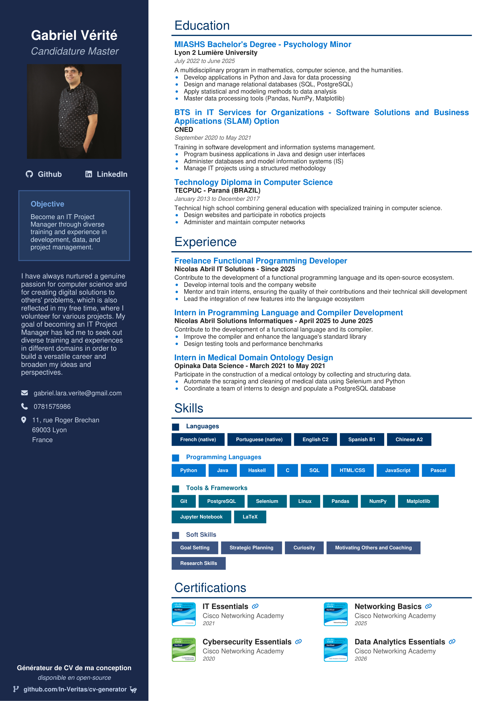

# CV Generator

**[English](README.md)** | **[Português](README.pt.md)** | **[Español](README.es.md)**

Creez un CV PDF professionnel en deux colonnes, apprecie des recruteurs et compatible ATS — soit avec une **application de bureau** (remplissez un formulaire, choisissez vos couleurs, cliquez sur Generer), soit **manuellement** avec Python et des fichiers de configuration JSON. Concu pour plaire aux recruteurs, compatible ATS (Applicant Tracking System) et optimise pour les dossiers d'admission en master.

## Apercu



> **Remarque :** Ce CV m'a permis d'obtenir une place dans mon nouveau master -- ce qui est plutot cool.

## A quoi ca sert

- **Candidatures en master** (MonMaster, dossiers universitaires) -- optimise pour les jurys d'admission francais
- **Candidatures a l'emploi** -- mise en page compatible ATS avec un taux eleve de detection de mots-cles
- **Profils freelance / professionnels** -- design moderne et epure avec des liens cliquables
- **CV multilingues** -- basculez entre francais, anglais, espagnol et portugais en un seul clic

## Deux facons de l'utiliser

| | Application de bureau (release) | Manuelle (Python + JSON) |
| --- | --- | --- |
| Pour | Tout le monde -- aucune connaissance technique requise | Ceux qui veulent tout regler finement |
| Requiert | Rien sous Windows/Linux ; Python sous macOS | Python 3.9+ |
| Controle | Contenu, photo, couleurs, tailles, ordre des sections, badges | Tout cela plus chaque parametre de style avance |

## Utiliser l'application de bureau (recommande)

### L'obtenir

Telechargez le paquet le plus recent depuis la [page Releases](https://github.com/In-Veritas/cv-generator/releases) et decompressez-le :

- **Windows** (`…-win64.zip`) : double-cliquez sur `CV-Generator.exe`. Si SmartScreen affiche « Windows a protege votre ordinateur », cliquez sur *Informations complementaires* → *Executer quand meme* (l'exe n'est simplement pas signe numeriquement).
- **Linux** (`…-linux-x64.tar.gz`) : lancez `chmod +x CV-Generator && ./CV-Generator` depuis le dossier decompresse.
- **macOS / tout OS** (`…-source.zip`) : installez Python 3.9+, puis `pip3 install -r requirements.txt` et `python3 cv_gui.py`.

Gardez les fichiers decompresses ensemble -- l'application lit `fonts/`, `cv_style.json`, `whale.png` et `app_icon.png` dans son propre dossier.

### L'utiliser

1. **Choisissez une langue** -- Francais, English, Espanol ou Portugues. Elle definit l'interface et les titres de sections imprimes sur le PDF, et se change a tout moment via le menu *Langue*.
2. **Remplissez les onglets.** Chaque zone de texte affiche une consigne grise expliquant quoi ecrire. Dans les onglets a listes (Formations, Experiences, Competences, Certifications), cliquez sur *Ajouter* pour creer une entree ; selectionnez une entree pour la modifier -- vos changements sont enregistres automatiquement pendant la saisie.
3. **Choisissez l'ordre des sections.** Faites glisser les onglets de sections pour les reordonner -- le PDF imprime ses sections dans cet ordre exact. Le menu *Prereglages* propose **Professionnel** (Experiences d'abord -- par defaut) et **Academique** (Formations d'abord).
4. **Personnalisez le style.** L'onglet *Style* propose des selecteurs de couleurs et de tailles, plus un bouton *Importer un style JSON…* qui charge un `cv_style.json` complet (voir la section manuelle ci-dessous pour tout ce qu'il peut contenir).
5. **Ajoutez des badges de certification.** L'onglet Certifications a un bouton *Aide* avec un guide pas a pas et un outil *Generer un badge…* qui recadre n'importe quelle image en carre et la redimensionne en 300×300 px.
6. **Generez.** L'application verifie les champs que les ATS et outils d'IA des recruteurs analysent habituellement (nom, coordonnees, objectif, entrees, competences, dates) et vous avertit s'ils sont vides -- puis produit le PDF ou vous voulez.

Astuces : **Fichier → Enregistrer les donnees (.json)** garde votre travail reutilisable (le fichier est entierement compatible avec le generateur en ligne de commande ci-dessous), et la petite baleine en bas a gauche ouvre ma page GitHub.

Le manuel complet de l'application -- avec le depannage -- est fourni dans chaque paquet et lisible ici : [release_readme.md](release_readme.md).

### Compiler l'application vous-meme

```bash
pip install -r requirements.txt pyinstaller
pyinstaller --onefile --windowed --name CV-Generator --icon whale.ico cv_gui.py
```

Un workflow GitHub Actions (`.github/workflows/build-release.yml`) compile automatiquement les paquets Windows, Linux et macOS a la demande ou quand un tag `v*` est pousse.

## Utilisation manuelle (Python + JSON)

Pour un controle total, pilotez le generateur directement et editez les fichiers JSON a la main.

```bash
pip install -r requirements.txt
python generate_cv.py
```

### Options

```bash
python generate_cv.py --data cv_data.json --style cv_style.json --lang cv_lang.json -o output.pdf
```

| Option    | Defaut          | Description                          |
| --------- | --------------- | ------------------------------------ |
| `--data`  | `cv_data.json`  | Chemin vers le contenu du CV         |
| `--style` | `cv_style.json` | Chemin vers la configuration visuelle |
| `--lang`  | `cv_lang.json`  | Chemin vers les libelles de langue    |
| `-o`      | `cv_output.pdf` | Chemin du PDF de sortie              |

### Les trois fichiers JSON

1. **`cv_data.json`** -- Votre contenu (qui vous etes, ce que vous avez fait). `cv_data_fr.json` est la version francaise de mes propres donnees, utilisable avec `--data`.
2. **`cv_style.json`** -- L'apparence (couleurs, polices, tailles, espacements).
3. **`cv_lang.json`** -- Les libelles de section et le sous-texte du pied de page dans la langue choisie.

Le generateur utilise `fpdf2` pour produire une mise en page a deux colonnes : une barre laterale bleu marine fonce (30%) avec les informations personnelles, la photo, l'objectif et les coordonnees, et une zone principale blanche (70%) avec les quatre sections de contenu. Tout le texte de la zone principale est quasi-noir sur blanc pour une lisibilite ATS maximale.

### Changer la langue

Editez `cv_lang.json` et definissez le champ `"lang"` sur `"fr"`, `"en"`, `"es"` ou `"pt"`. Cela change les titres de section, le titre de l'encadre Objectif et le sous-texte du pied de page. Le contenu lui-meme (descriptions, titres) doit etre traduit manuellement dans `cv_data.json`.

### Changer l'ordre des sections

Ajoutez une cle `"section_order"` dans `cv_data.json` (ordre par defaut montre) :

```json
"section_order": ["formations", "experiences", "skills", "certifications"]
```

### Descriptions et listes a puces

Les descriptions supportent un format hybride -- une phrase de contexte suivie de puces. Les lignes commencant par `-` sont rendues avec des puces colorees et une indentation appropriee :

```json
"description": "Phrase de contexte sur le poste.\n- Premiere realisation ou responsabilite\n- Deuxieme realisation avec resultats quantifies"
```

### Badges de certification

Placez l'image du badge (ex. telechargee depuis Credly) dans `badges/`, puis referencez-la dans l'entree de certification -- l'image et la petite icone de lien sont cliquables quand `url` est defini :

```json
{ "name": "IT Essentials", "issuer": "Cisco", "date": "2021",
  "url": "https://www.credly.com/...", "image": "badges/it_essentials.png" }
```

### Polices personnalisees

Ajoutez des fichiers TTF/OTF et referencez-les dans le style (indispensable pour les alphabets non latins) :

```json
"fonts": {
  "heading": "MaPolice",
  "body": "MaPolice",
  "custom": {
    "MaPolice": { "": "fonts/MaPolice-Regular.ttf", "B": "fonts/MaPolice-Bold.ttf", "I": "fonts/MaPolice-Italic.ttf" }
  }
}
```

### Tout ce que `cv_style.json` controle

- **Barre laterale** : ratio de largeur, couleur de fond, padding, taille de photo
- **Polices** : familles titre/corps, polices TTF/OTF personnalisees
- **Tailles de police** : chaque element de texte a sa propre taille configurable
- **Couleurs** : chaque element a sa propre couleur RGB
- **Espacements** : ecarts entre chaque section, ratio de hauteur de ligne
- **Badges** : padding, rayon, ecart, couleurs par style (rempli/contour/accent)
- **Section competences** : tailles de badges, couleurs par categorie
- **Certifications** : taille d'image, grille, colonnes
- **Encadre objectif** : fond, bordure, couleur du titre, couleur du texte, padding, rayon
- **Pied de page** : textes, taille de police, couleur, icones, URLs de lien et image

## Structure des fichiers

| Fichier | Role |
| --- | --- |
| `generate_cv.py` | Generateur de PDF (ligne de commande) |
| `cv_gui.py` | Application de bureau (interface par formulaire au-dessus du generateur) |
| `cv_data.json` / `cv_data_fr.json` | Contenu du CV (version anglaise / francaise) |
| `cv_style.json` | Parametres visuels (polices, tailles, couleurs, espacements, badges, pied de page) |
| `cv_lang.json` | Libelles de langue pour les titres de section et le pied de page |
| `fonts/` | Fichiers OTF Font Awesome 7 pour les icones |
| `badges/` | Images des badges de certification (Credly) |
| `whale.png` / `app_icon.png` / `whale.ico` | Mascotte du pied de page, icone de fenetre, icone de l'exe |
| `release_readme.md` | Guide utilisateur fourni dans les paquets de release |
| `.github/workflows/build-release.yml` | Compilations CI pour Windows, Linux et macOS |
| `requirements.txt` | Dependances Python (`fpdf2`, `pillow`) |

## Recherche sur le design

### Palette de couleurs

La palette a ete choisie sur la base de recherches provenant de sources du secteur du recrutement sur ce qui fonctionne le mieux aupres des recruteurs humains et des outils de screening ATS/IA.

**Pourquoi le bleu marine ?**

- Le bleu est la couleur de CV n1 recommandee par toutes les sources -- il evoque la confiance, la fiabilite et la competence
- Particulierement adapte au secteur tech/IT puisque la plupart des grandes entreprises technologiques utilisent le bleu dans leur branding
- La couleur bleu marine fonce pour les titres (`#003366`) a atteint un **taux de detection de mots-cles ATS de 98%** lors des tests

| Element            | Hex       | Justification                                       |
| ------------------ | --------- | --------------------------------------------------- |
| Fond barre laterale | `#1B2A4A` | Ratio de contraste avec texte blanc : ~12.5:1 (WCAG AAA) |
| Titres de section  | `#003366` | Taux de detection ATS de 98%                        |
| Titres d'elements  | `#0476D0` | Recommande pour les CV tech/IT                      |
| Texte principal    | `#212121` | Contraste avec blanc : ~16:1 (WCAG AAA)             |
| Texte secondaire   | `#555555` | Contraste avec blanc : ~7.5:1 (WCAG AA)             |

### Regles de compatibilite ATS

1. Le texte principal est quasi-noir sur blanc -- la "Regle 90-10"
2. Tous les mots-cles critiques sont dans la zone blanche principale, pas dans la barre laterale
3. Ratios de contraste eleves (minimum 4.5:1 selon WCAG AA) sur chaque combinaison texte-fond
4. Palette coherente a 2 couleurs (marine + accent bleu) plus neutres
5. Polices standard (Helvetica) -- universellement analysables par les ATS

### Formatage des descriptions

Les descriptions suivent les bonnes pratiques de CV academique pour les candidatures en master :

- Format hybride : une phrase de contexte + listes a puces
- Verbes d'action a l'infinitif (convention francaise)
- Realisations quantifiees autant que possible
- Mots-cles refletant les descriptions des programmes cibles

## Pied de page

Le pied de page en bas de la barre laterale affiche une ligne de texte avec des icones decoratives et un lien cliquable vers ce depot.

**Texte dynamique :** Lorsque le nom du CV est "Gabriel Verite" (l'auteur), le pied de page affiche *"Generateur de CV de ma conception"*. Pour tout autre nom, il devient automatiquement *"generated with CV Generator by In Veritas"*, ou **In Veritas** est un lien cliquable vers ma page GitHub. Configurable via `text`, `text_other`, `text_other_link_text` et `text_other_link_url` dans `cv_style.json`.

**Sous-texte localise :** la ligne du dessous (« disponible en open-source ») suit la langue du CV via la cle `footer_sub` de `cv_lang.json`.

**Dates de certification :** Chaque entree de certification supporte un champ optionnel `"date"` affiche en petit texte italique sous l'organisme emetteur.

### Icone baleine

La petite baleine a cote du lien du pied de page est une touche personnelle -- c'est mon animal prefere. C'est purement decoratif et sans impact sur l'analyse ATS (elle se trouve dans la barre laterale, hors de la zone de contenu principale). La meme baleine sert d'icone de fenetre a l'application (`app_icon.png`) et, dans l'application, de mascotte cliquable qui ouvre ma page GitHub.

Pour la retirer du CV, videz le champ `image_right` dans `cv_style.json` :

```json
"footer": {
  "image_right": "",
  ...
}
```

## Attribution

- <a href="https://www.flaticon.com/free-icons/whale" title="whale icons">Whale icons created by Mayor Icons - Flaticon</a>

## Sources

- [Resumly - Resume Color Scheme for ATS Compatibility & Readability](https://www.resumly.ai/blog/resume-color-scheme-for-ats-compatibility-and-readability)
- [AI ResumeGuru - Resume Colors: ATS-Safe Guide](https://airesume.guru/blog/resume-color-ats-safe-tips)
- [Resume.io - Best colors for a resume](https://resume.io/blog/should-you-use-color-on-your-resume)
- [Enhancv - How Does Color on a Resume Impact Your Chances?](https://enhancv.com/blog/color-on-resume/)
- [Jobscan - Should You Use Color on Your Resume?](https://www.jobscan.co/blog/best-color-for-resume/)
- [WebAIM - Contrast and Color Accessibility (WCAG 2)](https://webaim.org/articles/contrast/)
- [Mastersportal - 6 Steps to Writing an Awesome Academic CV](https://www.mastersportal.com/articles/2626/6-steps-to-writing-an-awesome-academic-cv-for-masters-application.html)
- [MakeMyCV - CV Master : Les cles pour seduire le jury](https://makemycv.com/fr/cv-master)
